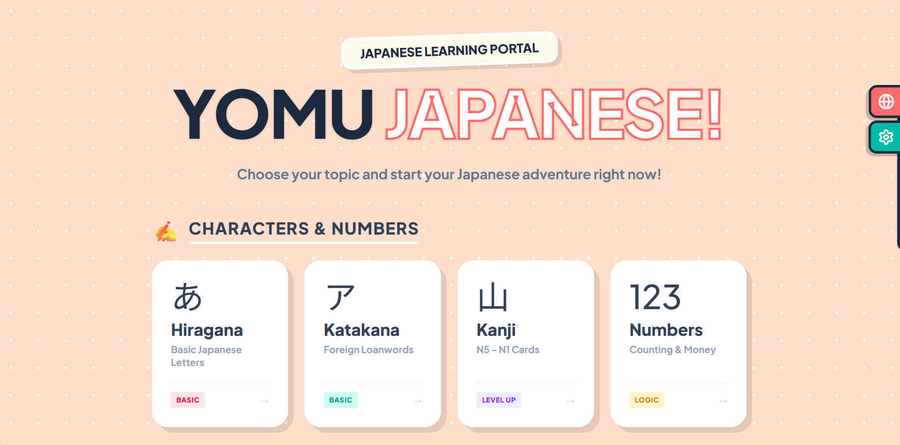

  <h1>
    
     
    Yomu Japanese (読む)
  </h1>

  <h3>Aplikasi Belajar Bahasa Jepang Interaktif dengan UI Ceria & Modern</h3>

  
  

<h2>🌸 Deskripsi</h2>

  

  <strong>Yomu Japanese</strong> adalah teman belajar bahasa Jepang yang dirancang agar <em>fun</em> dan jauh dari kata membosankan. Lupakan buku tebal yang kaku! Di sini, kamu akan diajak bertualang secara visual mulai dari mengenal huruf dasar (Hiragana & Katakana), menghafal Kanji N5-N1, hingga menguasai ribuan kosakata tematik—mulai dari "Isi Bento" hingga "Safari Hewan".

  Dibangun sebagai <strong>PWA (Progressive Web App)</strong>, Yomu bisa langsung di-install di HP kamu tanpa ribet, siap menemani belajar kapan saja dan di mana saja, bahkan saat offline sekalipun!

<h2>📚 Daftar Materi (Page List)</h2>

<h3>1. Huruf & Angka (Kana)</h3>
<ul>
  <li>あ <strong>Hiragana</strong> — Huruf dasar Jepang</li>
  <li>ア <strong>Katakana</strong> — Huruf kata asing</li>
  <li>山 <strong>Kanji</strong> — Kartu N5 - N1</li>
  <li>123 <strong>Angka (Suuji)</strong> — Hitungan & Uang</li>
</ul>

<h3>2. Kosakata (Vocabulary)</h3>
<ul>
  <li>🍱 <strong>Kotoba</strong> — Warna, Hari, Keluarga</li>
  <li>📦 <strong>Mono</strong> — Objek & Benda mati</li>
  <li>🏃 <strong>Kata Kerja (Doushi)</strong> — Konjugasi dasar</li>
  <li>✨ <strong>Kata Sifat (Keiyoushi)</strong> — Kata sifat-i & na</li>
  <li>💼 <strong>Profesi (Shigoto)</strong> — Pekerjaan & Karir</li>
  <li>🍜 <strong>Makanan (Tabemono)</strong> — Minuman & Rasa</li>
  <li>🐯 <strong>Hewan (Doubutsu)</strong> — Darat, Air, Terbang</li>
  <li>🚄 <strong>Transportasi (Norimono)</strong> — Kendaraan & Lalu lintas</li>
  <li>🏢 <strong>Bangunan (Tatemono)</strong> — Gedung & Fasilitas</li>
  <li>🍓 <strong>Buah (Kudamono)</strong> — Buah-buahan segar</li>
  <li>🌿 <strong>Tanaman (Shokubutsu)</strong> — Pohon & Bunga</li>
</ul>

<h3>3. Grammar (Tata Bahasa)</h3>
<ul>
  <li>🏗️ <strong>Bunpou</strong> — Pola Kalimat Dasar</li>
  <li>🔗 <strong>Partikel (Joshi)</strong> — Wa, Ga, Wo, Ni, De</li>
  <li>💬 <strong>Salam (Aisatsu)</strong> — Percakapan Sehari-hari</li>
</ul>

<h2>🛠️ Tech Stack</h2>
<ul>
  <li><strong>Framework:</strong> Vue 3 (Composition API)</li>
  <li><strong>Build Tool:</strong> Vite</li>
  <li><strong>Styling:</strong> Tailwind CSS v4</li>
  <li><strong>PWA:</strong> Vite Plugin PWA</li>
  <li><strong>Routing:</strong> Vue Router</li>
</ul>
